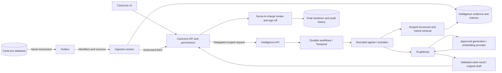

# Architecture, stack and data flow

## 1. Decision and boundaries

Build one modular intelligence service with separately scalable API/worker processes. Add agents as bounded modules using shared contracts, not a new microservice for every feature. Keep CareLens authoritative for identity, care records, role/floor/resident access, final handovers, medications, appointments and tasks. Intelligence owns derived evidence, indexes, draft versions, job state and model execution metadata.

The development skeleton is independent of CareLens at the package/deployment boundary even while both folders sit in one checkout. The production connector will use authenticated APIs. No CareLens ORM imports, direct care-database writes or shared database credentials are permitted.

## 2. Stack decisions

| Layer | Selection | Why / status |
|---|---|---|
| Language and schemas | Python 3.12, Pydantic 2 | Typed async contracts, fits existing team; implemented |
| API | FastAPI + Uvicorn, OpenAPI | Request validation and generated API explorer; implemented |
| Dependencies | uv, `uv.lock`; pinned runtime requirements export for Docker | Reproducible separate package; implemented |
| Agent composition | Plain Python protocols and explicit registry | Easy to test, model/framework neutral, no unrestricted autonomous loops; implemented |
| Evidence transport | `EvidenceReader` port | Synthetic implementation now; HTTPX CareLens adapter later |
| Gateway | Provider protocol, typed request/output validation | Fake structured adapter now; scoped free-text pseudonymisation later |
| Durable data | PostgreSQL 16, SQLAlchemy 2 async, asyncpg, Alembic | Planned separate intelligence database, tenant RLS and migration ownership |
| Retrieval | PostgreSQL full-text + pgvector; deterministic structured queries | Planned hybrid retrieval with filtered candidates and versioned embeddings; no standalone vector database initially |
| Long-running workflows | Temporal Python SDK behind a workflow runner port | Planned durable retries/timers/human wait states; prove crash/replay behaviour before adopting for pilot |
| Transient caching | None initially | Add Redis only if measured cache/rate-limit need justifies it; never make it the authoritative job or review store |
| Model | Fake now; provider selected using agreed evaluation/region/budget criteria | No model, paid run or vendor-specific SDK selected |
| Observability | Structured metadata logs, OpenTelemetry traces, Prometheus-compatible metrics | Planned; omit raw notes, prompts, answers and alias mappings from operational telemetry |
| Local deployment | Docker and Compose | API implemented; production data/workflow services introduced with their milestones |
| Cloud | AWS or Azure containers + managed PostgreSQL + secret manager | Undecided; portable OCI container, no cloud deployment in this change |
| UI | Existing CareLens interface | New search/review views later; no separate staff login portal |

PostgreSQL full-text and pgvector can be combined for hybrid search ([pgvector documentation](https://github.com/pgvector/pgvector)). Temporal provides persisted workflow histories and replay; non-deterministic I/O belongs in activities ([Temporal documentation](https://docs.temporal.io/), [Python SDK](https://github.com/temporalio/sdk-python)). Container packaging follows the independent-app approach described by [FastAPI](https://fastapi.tiangolo.com/deployment/docker/).

These choices avoid committing to a general-purpose agent framework before the two pilot workflows require one. An optional graph framework later belongs behind the agent interface; it must not own authorisation, authoritative records or gateway policy.

## 3. Current runnable path

```mermaid
sequenceDiagram
    participant Staff as Local synthetic API client
    participant API as Intelligence API
    participant Agent as Registered agent
    participant Reader as Synthetic evidence reader
    participant Gate as AI gateway
    participant Fake as Fake provider
    Staff->>API: POST /v1/runs + local token
    API->>API: Fixed server-owned scope; validate request
    API->>Agent: Authorised request and dependency context
    Agent->>Reader: Resident and bounded period
    Reader-->>Agent: Scoped synthetic records with source refs
    Agent->>Gate: Evidence + fixed intent (no question text)
    Gate->>Gate: Compute totals; create local aliases
    Gate->>Fake: Aliases + typed metrics only
    Fake-->>Gate: Typed claims
    Gate->>Gate: Check alias scope, sources and exact values
    Gate-->>Agent: Claims with restored source references
    Agent-->>API: Synthetic answer or unreviewed draft
    API-->>Staff: Result, coverage and limitations
```

Runs are synchronous and results volatile. HTTP 200 means this demo run completed; it does not mean reviewed, signed or clinically accepted. No route finalises handovers. Temporary alias maps are function-local; they do not appear in provider payloads. Results expire lazily on the next store operation, not via a background purge worker. Requests/questions are not stored; only the synthetic result is retained.

## 4. Target production flows



### A. Source ingestion and correction

1. CareLens commits record mutation and outbox event atomically. Event payload holds identity/version metadata, not an unrestricted note copy.
2. Worker authenticates using a service identity and explicit tenant/resident purpose; fetches the current source through CareLens.
3. Normalize all 14 clinical sources plus template care events into a versioned evidence envelope. Native generic observations, medical history and appointments remain excluded until explicitly added.
4. Upsert by source system + tenant + source type + source ID. Keep source version, effective/recorded/ingested timestamps, time precision, correction/deletion state and access provenance. Replayed events are idempotent. Do not deduplicate unrelated rows by similar text.
5. Build structured projections and indexed text. All external embedding requests pass gateway controls first. Derived snippets/embeddings remain protected resident data.
6. Delete/restrict affected derived content on source deletion/eligibility changes; reconcile full snapshots against checkpoints to detect lost events. Keep signed evidence according to its separate authorised record policy.

Current common observation API is offset-paginated and lacks stable snapshots/change cursors. Care events still have a latest-100 read limit and missing detail/version contracts. Do not interpret those endpoints as an existing lossless ingestion protocol.

### B. Resident enquiry

Validate service identity and delegated actor → resolve current scope → constrain resident/time/source allowlist → interpret question within supported intents → structured queries for numeric questions, lexical/vector search for narratives → merge/rerank scoped candidates → record evidence manifest/coverage → calculate deterministically → gateway minimisation/pseudonymisation → LLM → citation/claim validation → authorised re-identification → recheck access → display answer.

Queries and conversation history can themselves contain identifiers. Minimise them too. Never rely on model-generated SQL or model-provided tenant scope. Question-driven retrieval and hybrid search are target capabilities; the skeleton deliberately ignores question text.

### C. Handover

Confirm shift/timezone/roster → retrieve complete scoped evidence → assemble relevant concerns and documented follow-up → generate original immutable draft → save staff revisions separately → nurse in charge reviews exact version → CareLens checks current reviewer designation, resident access, source changes and result version → save signed final plus audit reference to original.

No reviewer or unverifiable source freshness means no finalisation. Corrections after finalisation create reviewed amendments and preserve the signed original. Late records trigger amendment review, not silent replacement. A 48-hour post-fall evidence window is an explicit enquiry option, not an automatic monitoring protocol.

### D. Future actions

An agent proposes a typed action → policy and recipient checks → explicit human approval when required → authoritative CareLens/email/calendar command → idempotent execution receipt → audit. Model text alone is never executable authority. Reminders use durable timers linked to confirmed tasks; unverified note extraction cannot silently create obligations.

## 5. Contracts and storage roadmap

Current contracts are in `core/contracts.py`; intentionally small for the running demo. Expand them through versioned changes rather than overloading free-form dictionaries.

| Contract / store | Required production meaning |
|---|---|
| Execution context | Verified service + actor, tenant, current permissions/resident scope, purpose, request ID and expiry; never trusted from ordinary JSON fields |
| Source envelope / `source_records` | Stable composite identity, revision/hash semantics, clinical payload, event/entry/ingestion times, precision, deletion and access state |
| Evidence manifest / `result_sources` | Exact source versions used for each claim and completeness checkpoint; supports rechecks and lawful retained review evidence |
| Jobs / `runs` | Queued/running/awaiting-review/completed/failed/cancelled/expired; owner/scope, agent/gateway/model versions, cost/time budget and idempotency key |
| Drafts / `result_versions` | Original AI version, attributed staff revisions, status, source manifest, linkage to signed CareLens record |
| Gateway mapping store | Encrypted, separately authorised request-scoped aliases with bounded retry lifetime; provider-facing code cannot query it |
| Ingestion / `ingestion_checkpoints` | Per-source export cursor, event deduplication, reconciliation state and measured lag |
| Telemetry / execution ledger | Metadata-only traces, cost/latency counters, failures and action receipts; sensitive review evidence stored separately |

Temporal history can persist activity inputs and outputs: pass opaque job/evidence IDs rather than raw care text or alias maps. Fetch content inside authorised activities; assess workflow payload encryption, retention, region and support access before real data. Workflow activities may retry; external commands need idempotency even with a durable engine.

## 6. Trust and gateway boundary

The trusted application/intelligence components handle confidential data. Pseudonymisation is not anonymity; rare conditions, dates and contextual narratives can identify a person. Region, contracts, retention, access and clinical-use decisions remain required. In production the gateway will combine structured minimisation, known-entity replacement, local text detection, outbound checks, request-scoped aliases, output validation and authorised local re-identification. Blocking unresolved leakage has no raw-data fallback.

The current synthetic gateway does something narrower: it only permits typed metrics and aliases, passes no narrative text, and validates fake provider values against deterministic totals. It cannot be switched to a real provider through an environment variable. This restriction is intentional until free-text protection and delegated access exist.

Production network controls should make the gateway the sole generation/embedding egress. Separate gateway credentials and mapping permissions; registry conventions alone cannot sandbox arbitrary Python agent code. Human code review, import checks, secret isolation and deployment network policy enforce this boundary together.

## 7. Repository map

```text
intelligence-service/
  pyproject.toml / uv.lock / requirements.lock
  Dockerfile / compose.yaml / .env.example
  src/intelligence/
    api/app.py              HTTP boundary and composition root
    config.py               synthetic-only validated settings
    core/contracts.py       requests, scope, evidence, results
    core/ports.py           evidence reader interface
    core/policy.py          resident/permission checks
    core/results.py         bounded memory adapter (replace with DB)
    core/errors.py          non-sensitive domain failures
    connectors/synthetic.py isolated deterministic fixtures
    gateway/contracts.py    safe provider payload/output interface
    gateway/fake.py         deterministic offline provider
    gateway/service.py      aliases, metrics, validation, source resolution
    agents/base.py          agent/context protocol
    agents/care.py          two small demo behaviours
    agents/registry.py      explicit capabilities
  tests/                    isolated checks; no CareLens fixtures
  docs/                     architecture, extension guide, milestones, verification
```

Add `persistence/`, `workflows/`, `workers/`, `retrieval/` and `actions/` when their milestones produce functioning code. Empty directories are not evidence that those capabilities exist.

## 8. Retention and operational ownership

Agreed product direction: conversations session-only/max 24 hours; abandoned drafts 30 days without activity (subject to review/hold); operational audit metadata 90 days; derived data only while needed and updated with source changes; temporary aliases removed after processing/permitted retries. Original AI drafts linked to final handovers follow the official care-record schedule with signed evidence. Exact production schedules/holds/deletion deadlines need the P0-06 decisions.

The demo keeps no conversations and uses a stricter 15-minute volatile result cache. This is not a production retention implementation or a durable handover archive. Do not apply it to real signed records.

You own technical development/evaluation; Glenrose reviews care realism, accuracy and usefulness. Production organisational/privacy and incident ownership remain to be assigned. Initial targets: p95 search ≤10s, floor draft ≤60s, source-change availability ≤60s; average model cost ≤£0.05/search and ≤£0.50/floor draft. No skeleton benchmark proves these targets for real models/data.
